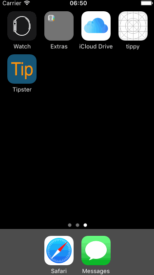

# Pre-work - Tip Calculator

**Name of your app** A Basic Tip Calculator App for iOS

Submitted by: Shobana Ramesh

Time spent: **15** hours spent in total

## User Stories

The following **required** functionality is complete:

* [x] User can enter a bill amount, choose a tip percentage, and see the tip and total values.
* [x] Settings page to change the default tip percentage.

The following **optional** features are implemented:
* [ ] UI animations
* [x] Remembering the bill amount across app restarts (if <10mins)
* [ ] Using locale-specific currency and currency thousands separators.
* [ ] Making sure the keyboard is always visible and the bill amount is always the first responder. This way the user doesn't have to tap anywhere to use this app. Just launch the app and start typing.

The following **additional** features are implemented:

- [ ] List anything else that you can get done to improve the app functionality!

## Video Walkthrough 

GIF created with [LiceCap](http://www.cockos.com/licecap/).
